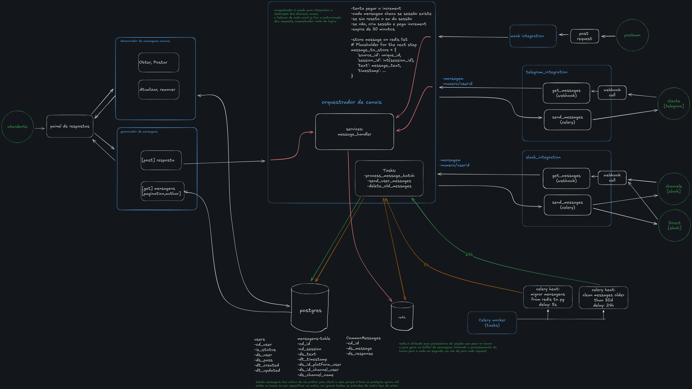

# Backend - Integrador de Canais

Servico backend responsavel por ingestao de mensagens, orquestracao, persistencia e APIs de consulta/atendimento.

## Responsabilidades

- Receber mensagens de integracoes (Telegram, Slack e mock)
- Normalizar payloads para o formato interno
- Orquestrar fila de mensagens em Redis
- Persistir mensagens e sessoes no PostgreSQL via worker assincrono
- Expor endpoints REST para listagem de sessoes/mensagens e envio de resposta

## Arquitetura do Backend

### Apps principais

- `orchestrator/`: regra central de enfileiramento e sincronizacao
- `message_manager/`: CRUD e endpoints usados pelo frontend
- `telegram_integration/`: webhook do Telegram
- `slack_integration/`: webhook do Slack
- `mock_integration/`: webhook de testes locais

### Fluxo

1. Integracao recebe webhook e traduz para payload padrao.
2. `orchestrator` grava a mensagem no Redis.
3. Celery Beat aciona tarefa periodica para mover lote do Redis para PostgreSQL.
4. `message_manager` entrega dados paginados para o frontend e publica respostas.

## Diagrama de Orquestracao



## Stack Tecnica

- Python 3.13
- Django + Django REST Framework
- Celery + Celery Beat
- Redis
- PostgreSQL
- drf-spectacular
- Poetry
- Docker Compose

## Execucao

### Pre-requisitos

- Docker
- Docker Compose

### Subir ambiente

```bash
cd backend
docker compose up --build
```

Servicos esperados:

- `web` (Django/Gunicorn/Uvicorn): `http://localhost:8000`
- `worker` (Celery worker)
- `beat` (Celery beat)
- `db` (PostgreSQL)
- `redis` (Redis)

## Variaveis de Ambiente

Copie `.env.example` para `.env` e ajuste os valores.

Principais chaves:

- `DEBUG`
- `SECRET_KEY`
- `ALLOWED_HOSTS`
- `CORS_ALLOWED_ORIGINS`
- `PG_NAME`, `PG_USER`, `PG_PASSWORD`, `PG_HOST`, `PG_PORT`
- `REDIS_HOST`, `REDIS_PORT`
- `TELEGRAM_TOKEN`
- `SLACK_BOT_OAUTH_TOKEN`
- `SLACK_READ_BOT_MESSAGES`

## Endpoints Principais

### Integracoes

- `POST /integrations/mock/message/`
- `POST /integrations/telegram/webhook/`
- `POST /integrations/slack/webhook/`

### Gerenciamento de mensagens

- `GET /manager/sessions/`
- `GET /manager/messages/`
- `POST /manager/messages/`
- `GET /manager/common_messages/`
- `POST /manager/common_messages/`
- `GET /manager/common_messages/<id>/`
- `PUT /manager/common_messages/<id>/`
- `DELETE /manager/common_messages/<id>/`

### Observabilidade da orquestracao

- `GET /orchestrator/redis_messages/`
- `GET /orchestrator/redis_sessions/`
- `GET /orchestrator/manual_run_worker/`

### Documentacao da API

- `GET /api/schema/`
- `GET /api/swagger/`
- `GET /api/redoc/`

## Testes

```bash
cd backend
poetry run python manage.py test
```

## Configuracao de Integracoes Externas

### Slack

1. Crie um app em `https://api.slack.com/apps`.
2. Ative `Event Subscriptions`.
3. Ative eventos `message.channels` e `message.im`.
4. Garanta escopos de leitura/escrita para canais e DMs.

### Telegram

1. Crie um bot com `@BotFather`.
2. Configure webhook para `https://SEU_DOMINIO/integrations/telegram/webhook/`.
